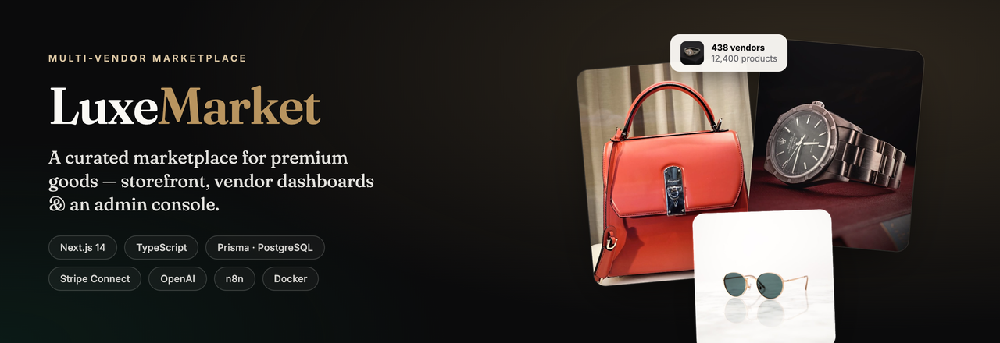
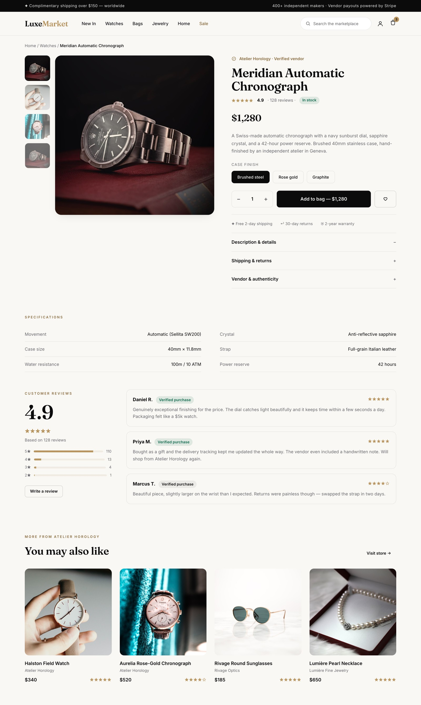
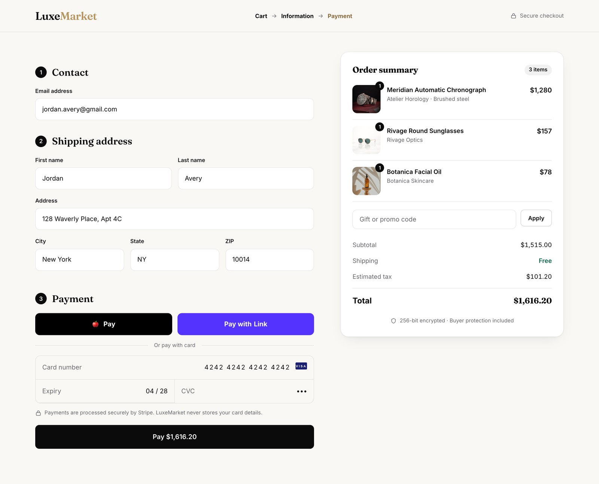
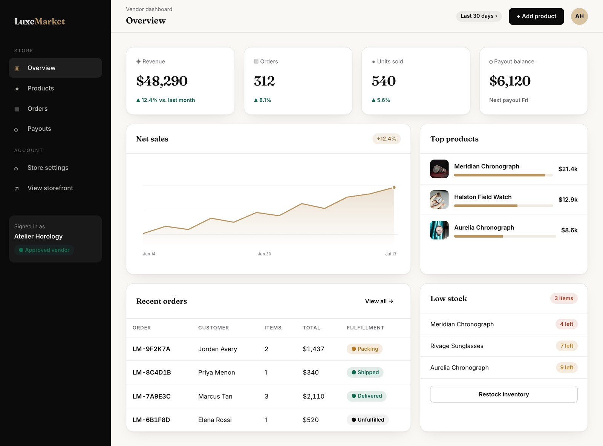
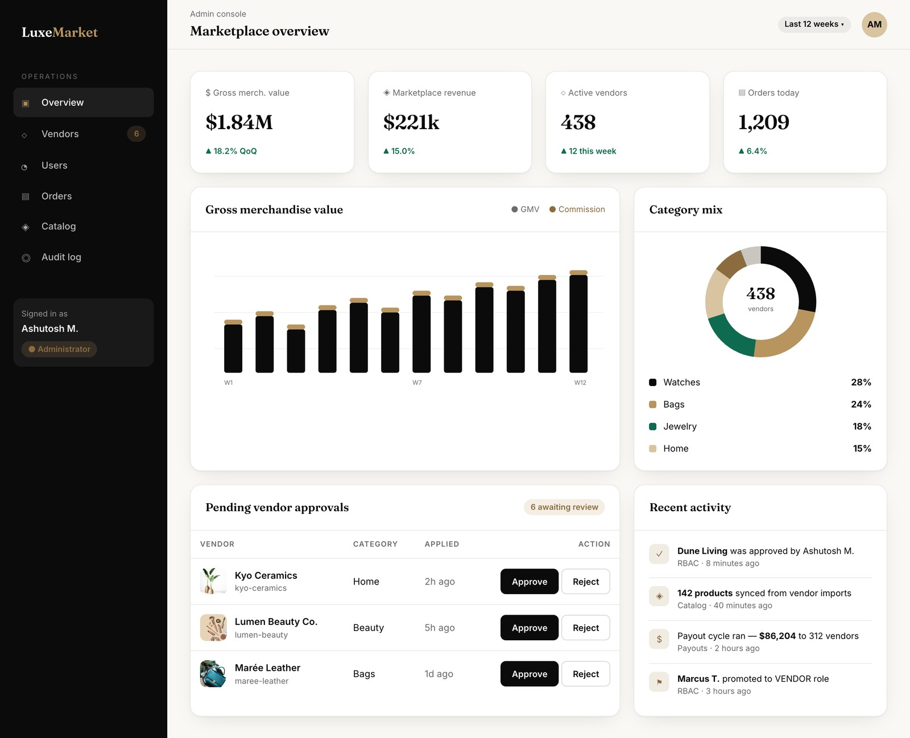
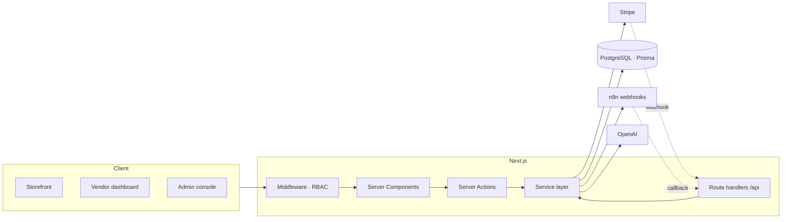
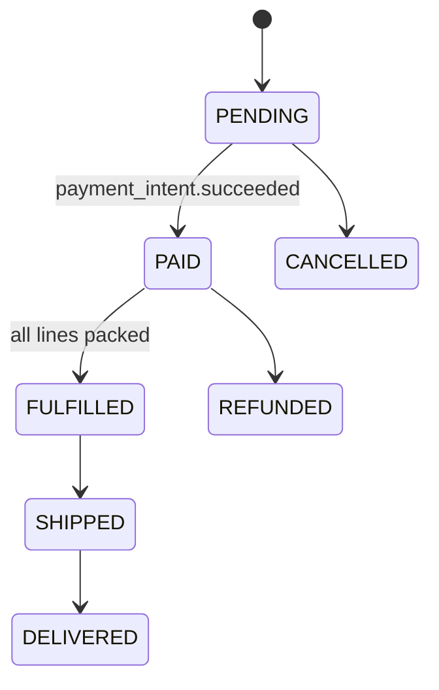

<div align="center">



<h1>LuxeMarket</h1>

**A multi-vendor marketplace for premium goods** — a curated storefront, full Stripe checkout and order lifecycle, vendor dashboards with inventory & payouts, and an admin console with role-based access control.

[](https://github.com/MittalAshutosh/LuxeMarket/actions/workflows/ci.yml)
[](LICENSE)


</div>

---

## Overview

**LuxeMarket** is a production-shaped, multi-vendor e-commerce marketplace built with the Next.js App Router. Independent vendors open storefronts, list products, and fulfil orders; customers browse a curated catalog, check out with Stripe, and track delivery; and administrators approve vendors and oversee the marketplace through a role-gated console.

It is designed to demonstrate end-to-end product engineering: a normalized relational data model, a typed service layer, secure payments with marketplace commission and vendor payouts, an event-driven integration surface (OpenAI + n8n), and a coherent, editorial design system across three distinct application surfaces.

> **Note** — LuxeMarket is a portfolio project built to showcase full-stack architecture and product design. The catalog uses license-free imagery and seeded demo data; no real transactions are processed.

## Table of contents

- [Feature highlights](#feature-highlights)
- [Screenshots](#screenshots)
- [Tech stack](#tech-stack)
- [Architecture](#architecture)
- [Project structure](#project-structure)
- [Getting started](#getting-started)
- [Environment variables](#environment-variables)
- [Scripts](#scripts)
- [Domain logic](#domain-logic)
- [Testing](#testing)
- [Documentation](#documentation)
- [Roadmap](#roadmap)
- [License](#license)

## Feature highlights

### 🛍️ Storefront
- Editorial home, category and search pages with **faceted filters** (category, price, vendor, rating, availability) and sorting
- Product detail pages with galleries, specs, verified-buyer reviews and rating distributions
- Per-vendor storefronts, wishlists and a persistent cart

### 💳 Checkout & orders
- **Stripe** Payment Element checkout with tax and shipping calculation (all money handled in integer cents)
- Full order lifecycle: `PENDING → PAID → FULFILLED → SHIPPED → DELIVERED` (plus cancel/refund)
- Multi-vendor order splitting — a single order fans out into per-vendor line items with independent fulfilment
- Delivery tracking with carrier scan-event timelines

### 🏪 Vendor dashboards
- Sales analytics (revenue, orders, units, AOV) with 30-day charts and top-product breakdowns
- Product management with inventory and low-stock alerts
- **AI-assisted product descriptions** — one click drafts premium copy via OpenAI
- Order fulfilment queue and a transparent **payouts** ledger with commission breakdown

### 🛠️ Admin console
- Marketplace KPIs (GMV, commission revenue, active vendors) with revenue and category-mix charts
- **Vendor approval** workflow, user & role management, catalog moderation
- **Role-based access control** (`CUSTOMER` / `VENDOR` / `ADMIN`) enforced at the edge (middleware), in server actions, and in the UI — every privileged mutation is written to an audit log

### 🔌 Integrations & platform
- **OpenAI** product-copy generation with structured output
- **n8n** webhook automations for order notifications and vendor onboarding (HMAC-signed, idempotent)
- Stripe webhooks with signature verification and replay-safe processing
- Dockerized (multi-stage build + `docker-compose` for Postgres, app and n8n), CI on GitHub Actions, CodeQL, unit + e2e tests

## Screenshots

<div align="center">

### Storefront — home


### Product detail &nbsp;•&nbsp; Catalog with filters



### Stripe checkout


### Vendor dashboard


### Admin console


</div>

## Tech stack

| Layer | Technology |
| --- | --- |
| **Framework** | Next.js 14 (App Router, React Server Components, Server Actions) |
| **Language** | TypeScript (strict, `noUncheckedIndexedAccess`) |
| **Database** | PostgreSQL via Prisma ORM |
| **Auth** | NextAuth (credentials) with JWT sessions + RBAC |
| **Payments** | Stripe (Payment Element, webhooks, Connect-style payouts) |
| **AI** | OpenAI (product-description generation) |
| **Automation** | n8n (HMAC-signed webhooks) |
| **UI** | Tailwind CSS, Radix UI primitives, custom design system, Recharts |
| **Validation** | Zod |
| **Testing** | Vitest + Testing Library (unit), Playwright (e2e) |
| **Tooling** | ESLint, Prettier, Husky, lint-staged, Docker, GitHub Actions, CodeQL |

## Architecture

LuxeMarket is a single Next.js application organized into three surfaces (storefront, vendor, admin) over a shared, typed **service layer** that owns all database and third-party access. Route handlers and Server Actions never touch Prisma directly — they call services in `src/server/services`, which keep business rules (commission math, order state transitions, idempotency) in one place.



See [`docs/ARCHITECTURE.md`](docs/ARCHITECTURE.md) for the full request lifecycle, order state machine, and integration design, and [`docs/DATA_MODEL.md`](docs/DATA_MODEL.md) for the entity-relationship model.

## Project structure

```
luxe-ecom/
├─ prisma/
│  ├─ schema.prisma          # data model: users, vendors, catalog, orders, payouts…
│  └─ seed.ts                # deterministic demo data
├─ src/
│  ├─ app/
│  │  ├─ (storefront)/       # home, search, product, cart, checkout, orders
│  │  ├─ vendor/             # vendor dashboard (products, orders, payouts, settings)
│  │  ├─ admin/              # admin console (vendors, users, catalog, audit)
│  │  └─ api/                # auth, stripe & n8n webhooks, health
│  ├─ components/            # ui primitives + storefront / vendor / admin components
│  ├─ server/
│  │  ├─ services/           # typed business logic (catalog, cart, orders, payouts…)
│  │  └─ actions/            # server actions (Zod-validated, RBAC-guarded)
│  ├─ lib/                   # prisma, auth, rbac, stripe, openai, n8n, utils, env
│  └─ middleware.ts          # edge RBAC route protection
├─ integrations/n8n/         # exported n8n workflows
├─ docs/                     # architecture, data model, API, deployment, ADRs
├─ tests/                    # vitest unit + playwright e2e
└─ docker-compose.yml        # postgres + app + n8n
```

## Getting started

### Prerequisites
- Node.js 20+ and [pnpm](https://pnpm.io) 9+
- Docker (for PostgreSQL and n8n), or a local PostgreSQL instance

### Quick start

```bash
# 1. Clone
git clone https://github.com/MittalAshutosh/LuxeMarket.git
cd LuxeMarket

# 2. Install dependencies
pnpm install

# 3. Configure environment
cp .env.example .env        # then fill in the values

# 4. Start Postgres (and n8n) with Docker
docker compose up -d db

# 5. Set up the database
pnpm db:push                # apply the schema
pnpm db:seed                # load demo catalog, vendors and orders

# 6. Run the app
pnpm dev                    # → http://localhost:3000
```

Demo accounts created by the seed (password `Passw0rd!`):

| Role | Email |
| --- | --- |
| Admin | `admin@luxemarket.dev` |
| Vendor | `atelier@luxemarket.dev` |
| Customer | `jordan@luxemarket.dev` |

> Prefer containers? `docker compose up --build` starts Postgres, the app and n8n together. See [`docs/DEPLOYMENT.md`](docs/DEPLOYMENT.md).

## Environment variables

Copy [`.env.example`](.env.example) to `.env`. Key variables:

| Variable | Purpose |
| --- | --- |
| `DATABASE_URL` | PostgreSQL connection string |
| `NEXTAUTH_SECRET` | NextAuth session signing secret |
| `STRIPE_SECRET_KEY` / `STRIPE_WEBHOOK_SECRET` | Stripe payments & webhook verification |
| `NEXT_PUBLIC_STRIPE_PUBLISHABLE_KEY` | Stripe.js publishable key |
| `OPENAI_API_KEY` | Product-description generation |
| `N8N_WEBHOOK_URL` / `N8N_WEBHOOK_SECRET` | Automation webhooks (HMAC) |

Environment variables are validated at boot with Zod (`src/lib/env.ts`) — the app fails fast in production on invalid configuration.

## Scripts

| Command | Description |
| --- | --- |
| `pnpm dev` | Start the dev server |
| `pnpm build` | Production build (`prisma generate` + `next build`) |
| `pnpm test` | Run unit tests (Vitest) |
| `pnpm test:e2e` | Run end-to-end tests (Playwright) |
| `pnpm lint` / `pnpm typecheck` | Lint / type-check |
| `pnpm db:push` / `pnpm db:migrate` | Sync / migrate the schema |
| `pnpm db:seed` | Seed demo data |
| `pnpm db:studio` | Open Prisma Studio |

## Domain logic

**Money** is stored and computed exclusively in integer minor units (cents) to avoid floating-point drift.

**Marketplace commission** is charged per line item at the vendor's rate (basis points):

```
commissionCents     = round(unitPriceCents × quantity × commissionBps / 10_000)
vendorEarningsCents = (unitPriceCents × quantity) − commissionCents
```

**Order lifecycle** — a single customer order splits across vendors, each line advancing through its own fulfilment states while the parent order reflects the slowest line:



**Idempotency** — Stripe and n8n webhooks are recorded in a `WebhookEvent` ledger keyed by event id, so a redelivered event is processed exactly once.

## Testing

```bash
pnpm test         # unit: RBAC matrix, money/commission math, slug & date utils
pnpm test:e2e     # e2e: checkout, vendor product creation, admin approval
```

Unit tests cover the permission matrix, integer-cent money formatting, and the commission split (asserting no float drift across a large input sweep). See [`tests/README.md`](tests/README.md).

## Documentation

| Document | Contents |
| --- | --- |
| [Architecture](docs/ARCHITECTURE.md) | System design, request lifecycle, order state machine |
| [Data model](docs/DATA_MODEL.md) | ER diagram and entity reference |
| [API](docs/API.md) | Route handlers and server-action surface |
| [Deployment](docs/DEPLOYMENT.md) | Local, Docker and production setup |
| [ADRs](docs/adr) | Architecture decision records |

## Roadmap

- [ ] Algolia-backed search with typo tolerance
- [ ] Vendor Stripe Connect onboarding (Express accounts)
- [ ] Buyer/vendor messaging
- [ ] Multi-currency pricing & tax providers
- [ ] Recommendations from purchase history

## License

Released under the [MIT License](LICENSE).

<div align="center">
<sub>Built by <a href="https://github.com/MittalAshutosh">Ashutosh Mittal</a> · Designed & engineered end-to-end</sub>
</div>
