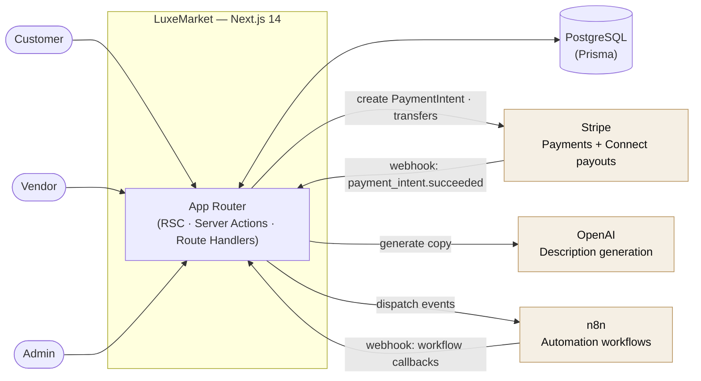
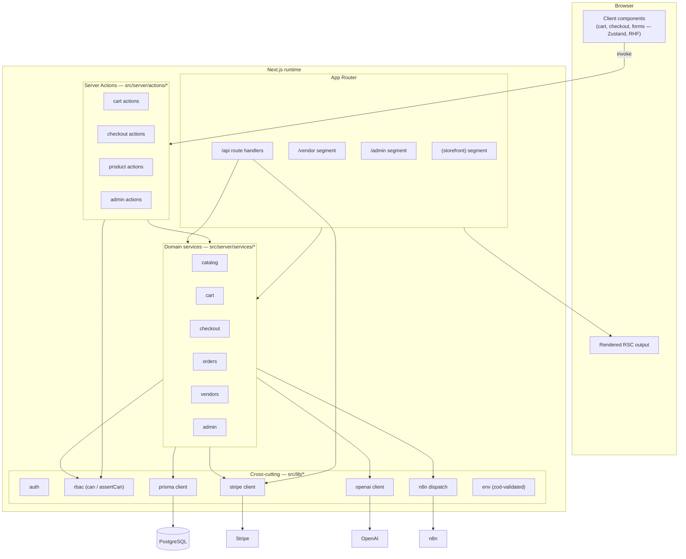
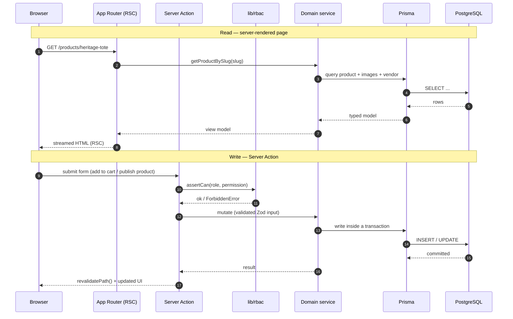
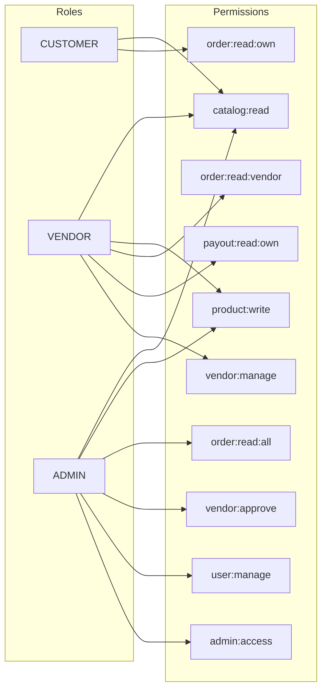
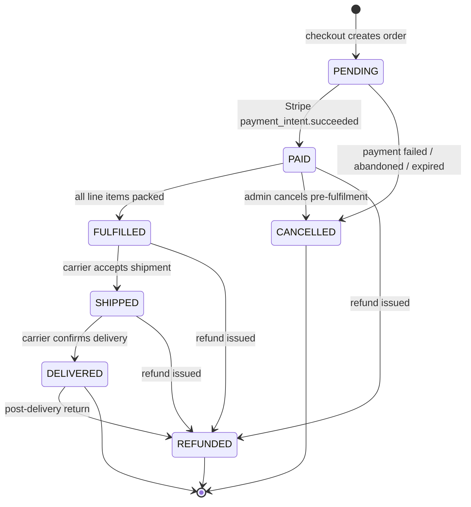
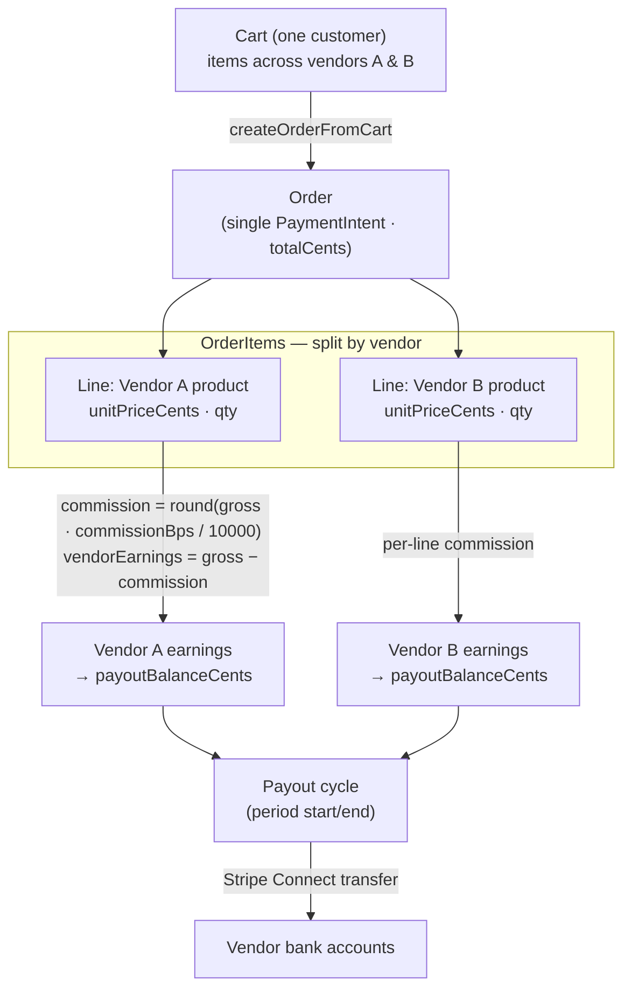

# Architecture

> System overview for **LuxeMarket** — a multi-vendor marketplace for premium
> goods. This document explains how the pieces fit together: the runtime, the
> request lifecycle, the App Router layout, the RBAC model, the order state
> machine, multi-vendor order splitting and payouts, and the external
> integrations (Stripe, OpenAI, n8n).

- **Framework:** Next.js 14 (App Router, React Server Components + Server Actions)
- **Language:** TypeScript (`strict`, `noUncheckedIndexedAccess`)
- **Data:** PostgreSQL via Prisma ORM
- **Auth:** NextAuth (credentials) with the Prisma adapter
- **Payments:** Stripe (PaymentIntents + Connect transfers for payouts)
- **AI:** OpenAI (product-description copywriting)
- **Automation:** n8n (webhook-driven workflows)
- **UI:** Tailwind CSS + Radix UI primitives, Recharts, Zustand

Related reading: [`DATA_MODEL.md`](./DATA_MODEL.md) · [`API.md`](./API.md) ·
[`DEPLOYMENT.md`](./DEPLOYMENT.md) · [ADRs](./adr/)

---

## 1. System context

LuxeMarket is a single Next.js application that serves three audiences from one
codebase — **customers** browsing and buying, **vendors** managing their store
and fulfilment, and **admins** operating the marketplace — plus a set of machine
callers (Stripe, n8n, uptime checks) that hit webhook and health endpoints.



---

## 2. Component view (C4-ish)

A container/component breakdown of the single deployable. Server-only modules
(`src/server/**`, `src/lib/{prisma,stripe,openai,n8n,auth}.ts`) never ship to the
browser; client components are the leaf UI that needs interactivity.



**Layering rule of thumb:**

| Layer | Directory | Responsibility |
| --- | --- | --- |
| Presentation | `src/app/**`, `src/components/**` | Routing, layouts, RSC rendering, client interactivity |
| Server actions | `src/server/actions/**` | Mutations invoked from forms/UI; validate input, guard with RBAC, call services |
| Domain services | `src/server/services/**` | Business logic and data access; the only place that composes Prisma queries |
| Cross-cutting libs | `src/lib/**` | Prisma/Stripe/OpenAI/n8n clients, auth, RBAC, env, formatting helpers |

Presentation never touches Prisma directly — it goes through services (for reads)
or actions (for writes). This keeps query logic testable and out of React.

---

## 3. Request lifecycle

Two shapes dominate: a **read render** (RSC pulling data through services) and a
**mutation** (a Server Action, guarded by RBAC, calling a service).



Principles enforced across every request:

1. **Validate at the edge.** All external input (form data, query params, webhook
   bodies) is parsed with Zod before it reaches a service.
2. **Authorize before mutating.** Privileged actions call `assertCan(role, permission)`
   (see [§4](#4-rbac-model)); services assume the caller is already authorized but
   still scope queries by owner (`vendorId`, `customerId`).
3. **Money never leaves integer space.** Amounts are integer cents end to end
   (see [ADR 0002](./adr/0002-money-as-integer-cents.md)).
4. **Fail fast on config.** `src/lib/env.ts` validates environment variables and
   throws in production if anything required is missing or malformed.

---

## 4. RBAC model

Access control is a small, explicit capability map in
[`src/lib/rbac.ts`](../src/lib/rbac.ts). Roles (`CUSTOMER`, `VENDOR`, `ADMIN`) are
stored on `User.role`; each role grants a fixed set of coarse-grained
**permissions**. There is a single check, `can(role, permission)`, and its
throwing counterpart `assertCan(role, permission)` (raising `ForbiddenError`).



| Permission | CUSTOMER | VENDOR | ADMIN | Meaning |
| --- | :---: | :---: | :---: | --- |
| `catalog:read` | ✅ | ✅ | ✅ | Read public catalog |
| `order:read:own` | ✅ | | | Read one's own orders |
| `product:write` | | ✅ | ✅ | Create/update products |
| `order:read:vendor` | | ✅ | | Read orders containing the vendor's items |
| `payout:read:own` | | ✅ | | Read one's own payouts/balance |
| `vendor:manage` | | ✅ | | Manage own store profile |
| `order:read:all` | | | ✅ | Read every order |
| `vendor:approve` | | | ✅ | Approve/suspend vendors |
| `user:manage` | | | ✅ | Manage users |
| `admin:access` | | | ✅ | Enter the admin console |

**Enforcement is layered:**

- **Route segment** — the `/vendor` and `/admin` layouts resolve the session with
  `requireRole(...)` (from `src/lib/auth.ts`) and redirect unauthorized users.
- **Server action / route handler** — `assertCan(role, permission)` before any
  privileged mutation.
- **Data scoping** — services still filter by ownership (`where: { vendorId }`),
  so a bug in a higher layer cannot leak another tenant's rows.

---

## 5. App Router structure

The app is organized by audience. A route group `(storefront)` keeps the public
shopping experience under `/` without adding a URL prefix, while `/vendor` and
`/admin` are protected sections with their own layouts.

```
src/app/
├── layout.tsx                 # Root layout (fonts, providers, globals)
├── globals.css                # Design tokens + base styles
├── (storefront)/              # Public shopping — no URL prefix
│   ├── page.tsx               #   Home / featured
│   ├── products/              #   Listing + /products/[slug]
│   ├── categories/            #   Category browse
│   ├── vendors/[slug]/        #   Vendor storefronts
│   ├── cart/                  #   Cart
│   ├── checkout/              #   Checkout (Stripe Elements)
│   ├── orders/                #   Customer order history + [orderNumber]
│   └── account/               #   Profile & addresses
├── vendor/                    # Vendor dashboard (VENDOR/ADMIN)
│   ├── layout.tsx             #   requireRole("VENDOR")
│   ├── page.tsx               #   Stats overview (Recharts)
│   ├── products/              #   CRUD + AI description generation
│   ├── orders/                #   Fulfilment queue
│   └── payouts/               #   Balance & payout history
├── admin/                     # Admin console (ADMIN)
│   ├── layout.tsx             #   requireRole("ADMIN")
│   ├── page.tsx               #   Marketplace stats
│   ├── vendors/               #   Approvals / suspensions
│   ├── orders/                #   All orders
│   └── users/                 #   User management
└── api/                       # Route handlers (machine + auth)
    ├── auth/[...nextauth]/     #   NextAuth
    ├── webhooks/stripe/       #   Stripe events (raw body)
    ├── webhooks/n8n/          #   n8n callbacks
    ├── products/describe/     #   OpenAI description generation
    └── health/                #   Liveness/readiness probe
```

Server components are the default; `"use client"` is reserved for genuinely
interactive leaves (cart drawer, checkout form, chart tooltips). Mutations flow
through **Server Actions** in `src/server/actions/*` rather than bespoke API
routes — the `/api` surface is reserved for machine callers (auth, webhooks,
health) and the AI helper. See [`API.md`](./API.md) for the full surface.

---

## 6. Order lifecycle state machine

An order is created `PENDING` when the customer checks out. Stripe confirms
payment asynchronously via webhook, moving it to `PAID`. Fulfilment then advances
per vendor line, and the order rolls up to `FULFILLED → SHIPPED → DELIVERED`.
`CANCELLED` and `REFUNDED` are terminal exits available at the appropriate stages.



**Who drives each transition**

| Transition | Trigger | Owner |
| --- | --- | --- |
| `→ PENDING` | `createOrderFromCart()` at checkout | Checkout action |
| `PENDING → PAID` | `payment_intent.succeeded` webhook → `markOrderPaid()` | Stripe |
| `PENDING → CANCELLED` | Payment failure / timeout | System / Stripe |
| `PAID → FULFILLED` | Every `OrderItem.fulfillmentStatus` reaches `PACKED` | Vendors (`advanceFulfillment`) |
| `FULFILLED → SHIPPED` | Shipment created / carrier handoff | Vendor / n8n |
| `SHIPPED → DELIVERED` | Carrier delivery scan | Shipment webhook |
| `* → REFUNDED` | Refund via Stripe | Admin |
| `PENDING/PAID → CANCELLED` | Manual cancel | Admin |

The order-level `OrderStatus` is a **roll-up** of per-line
`FulfillmentStatus`. A single order can contain items from multiple vendors, each
fulfilling independently; the order only advances to `FULFILLED`/`SHIPPED`/
`DELIVERED` once **all** its lines have reached the corresponding stage. See
[`orders` service](./API.md#server-actions--services) `advanceFulfillment()`.

---

## 7. Multi-vendor order splitting, commission & payouts

The defining marketplace mechanic: one customer basket can contain products from
several vendors, but the customer pays **once**. At order creation the basket is
split into `OrderItem` rows keyed by `vendorId`, and the marketplace commission is
computed and **stored per line** so it is auditable and immune to later changes in
a vendor's rate.



**Commission formula (per line, integer math):**

```
gross          = unitPriceCents * quantity
commissionCents      = round(gross * vendor.commissionBps / 10000)
vendorEarningsCents  = gross - commissionCents
```

`commissionBps` is basis points on the `Vendor` (default `1200` = 12%). Because it
is captured on the `OrderItem` at sale time, historical earnings never shift when a
vendor is later re-rated. See
[ADR 0003](./adr/0003-per-line-commission-and-vendor-payouts.md).

**Payout flow**

1. On payment success, each line's `vendorEarningsCents` accrues to the vendor's
   running `Vendor.payoutBalanceCents`.
2. A scheduled **payout cycle** (see [`DEPLOYMENT.md`](./DEPLOYMENT.md#running-the-payout-cycle))
   sweeps balances for a period, creating a `Payout` (`PENDING`) per eligible
   vendor and issuing a Stripe Connect transfer.
3. Stripe transfer webhooks advance `Payout.status`
   (`PENDING → IN_TRANSIT → PAID`, or `FAILED`), and `stripeTransferId` links the
   record back to Stripe for reconciliation.

---

## 8. Integration points

### Stripe

- **Client:** `src/lib/stripe.ts` (server-only, configured with `STRIPE_SECRET_KEY`).
- **Checkout:** `createPaymentIntent(userId)` computes totals server-side and
  creates a PaymentIntent; the browser confirms it with Stripe Elements using
  `NEXT_PUBLIC_STRIPE_PUBLISHABLE_KEY`.
- **Fulfilment:** `POST /api/webhooks/stripe` verifies the signature with
  `STRIPE_WEBHOOK_SECRET`, records the event for idempotency (`WebhookEvent`),
  and calls `markOrderPaid()`.
- **Payouts:** Stripe Connect transfers (`STRIPE_CONNECT_CLIENT_ID`,
  `Vendor.stripeAccountId`).

### OpenAI

- **Client:** `src/lib/openai.ts` — `generateProductDescription({ title, category, attributes, tone })`.
- **Surface:** `POST /api/products/describe` (guarded by `product:write`). Products
  written this way set `Product.aiGenerated = true` so AI-authored copy is
  distinguishable and reviewable.
- **Model:** configurable via `OPENAI_MODEL` (default `gpt-4o-mini`).

### n8n

- **Outbound:** `src/lib/n8n.ts` → `dispatchN8nEvent(type, payload)` posts to
  `N8N_WEBHOOK_URL` (e.g. `order.paid`, `vendor.approved`, `payout.created`) to
  drive notification/logistics automations.
- **Inbound:** `POST /api/webhooks/n8n` accepts workflow callbacks (shared-secret
  authenticated via `N8N_WEBHOOK_SECRET`), also de-duplicated through
  `WebhookEvent`.

### Webhook idempotency

Both Stripe and n8n deliveries are recorded in `WebhookEvent` keyed by a unique
`eventId`. A redelivered event finds an existing row (or a set `processedAt`) and
is acknowledged without re-running side effects — so a double-delivered
`payment_intent.succeeded` can never pay an order twice. See
[`DATA_MODEL.md`](./DATA_MODEL.md#webhookevent).

---

## 9. Cross-cutting concerns

- **Configuration** — `src/lib/env.ts` (Zod) validates env at boot; production
  refuses to start on invalid config.
- **Type safety** — TypeScript `strict` + `noUncheckedIndexedAccess`; Prisma
  generates types from the schema, so the data model is the single source of truth.
- **Auditing** — privileged admin actions append to `AuditLog` (actor, action,
  target, metadata, IP).
- **Observability** — `/api/health` for probes; structured logs around webhooks
  and payouts.
- **Testing** — Vitest for unit/service logic (commission math, RBAC, state
  transitions); Playwright for end-to-end flows.
