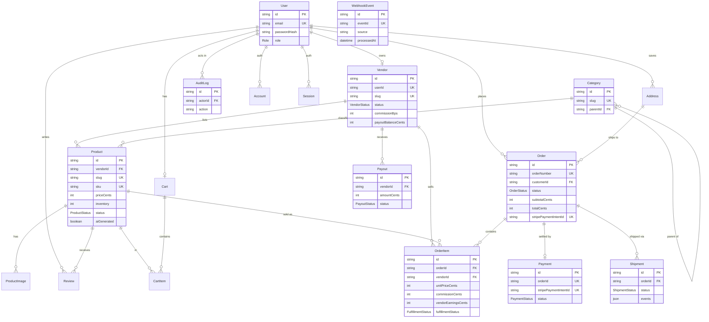

# Data Model

> Entity reference for **LuxeMarket**, derived from
> [`prisma/schema.prisma`](../prisma/schema.prisma) — the single source of truth.
> The schema itself always wins; this document adds an ER overview, per-entity
> notes, and the reasoning behind the trickier decisions.

- **Database:** PostgreSQL
- **ORM:** Prisma (`@prisma/client`) — models generate the app's TypeScript types
- **IDs:** `cuid()` strings
- **Money:** integer **cents** (`*Cents`) — never floats
   ([ADR 0002](./adr/0002-money-as-integer-cents.md))

---

## Entity-relationship diagram



---

## Enumerations

| Enum | Values | Used by |
| --- | --- | --- |
| `Role` | `CUSTOMER`, `VENDOR`, `ADMIN` | `User.role` |
| `VendorStatus` | `PENDING`, `APPROVED`, `SUSPENDED`, `REJECTED` | `Vendor.status` |
| `ProductStatus` | `DRAFT`, `ACTIVE`, `ARCHIVED` | `Product.status` |
| `OrderStatus` | `PENDING`, `PAID`, `FULFILLED`, `SHIPPED`, `DELIVERED`, `CANCELLED`, `REFUNDED` | `Order.status` |
| `FulfillmentStatus` | `UNFULFILLED`, `PACKED`, `SHIPPED`, `DELIVERED` | `OrderItem.fulfillmentStatus` |
| `PaymentStatus` | `REQUIRES_PAYMENT`, `PROCESSING`, `SUCCEEDED`, `FAILED`, `REFUNDED` | `Payment.status` |
| `ShipmentStatus` | `LABEL_CREATED`, `IN_TRANSIT`, `OUT_FOR_DELIVERY`, `DELIVERED`, `EXCEPTION` | `Shipment.status` |
| `PayoutStatus` | `PENDING`, `IN_TRANSIT`, `PAID`, `FAILED` | `Payout.status` |

The `OrderStatus` progression is documented as a state machine in
[`ARCHITECTURE.md`](./ARCHITECTURE.md#6-order-lifecycle-state-machine).

---

## Entities

### Identity & access

#### User
The account root. Holds credentials (`passwordHash` for NextAuth credentials
login) and a `role` that drives [RBAC](./ARCHITECTURE.md#4-rbac-model). One user
optionally owns one `Vendor`, one `Cart`, and many orders/reviews/addresses.

- **Key fields:** `email` (unique), `role` (`@default(CUSTOMER)`), `passwordHash?`
- **Indexes:** `@@index([role])`
- **Auth adapter:** `Account`, `Session`, `VerificationToken` are the standard
  NextAuth Prisma-adapter models; `Account`/`Session` cascade-delete with the user.

#### Vendor
A seller's store, one-to-one with a `User`.

- **Key fields:** `storeName`, `slug` (unique, public URL), `status`
  (`@default(PENDING)` — sellers are approved by an admin), `commissionBps`
  (`@default(1200)` = 12%), `payoutBalanceCents` (accrued earnings not yet paid
  out), `stripeAccountId` (Connect), `ratingAvg`/`ratingCount` (denormalized).
- **Indexes:** `@@index([status])` for the admin approvals queue.
- **Lifecycle:** `PENDING → APPROVED` (or `REJECTED`); `APPROVED → SUSPENDED`.

### Catalog

#### Category
Self-referential tree via `parentId` (relation `"CategoryTree"`), enabling nested
browse (e.g. *Home → Lighting → Table Lamps*).

- **Key fields:** `name`, `slug` (unique), optional `parentId`.

#### Product
A listing owned by a `Vendor` and optionally classified under a `Category`.

- **Key fields:** `title`, `slug` (unique), `description` (`@db.Text`),
  `priceCents`, `compareAtCents?` (strike-through/"was" price), `currency`
  (`@default("USD")`), `sku` (unique), `inventory` (`@default(0)`), `status`
  (`@default(DRAFT)`), `aiGenerated` (true when the copy came from the OpenAI
  generator), denormalized `ratingAvg`/`ratingCount`.
- **Indexes:** `@@index([vendorId])`, `@@index([categoryId])`, `@@index([status])`.
- **Cascade:** deleting a vendor cascades to its products.

#### ProductImage
Ordered gallery images (`position`) with optional `alt` text. Cascades with the
product. Indexed by `productId`.

### Cart

#### Cart / CartItem
One `Cart` per user (`userId` unique). `CartItem` has
`@@unique([cartId, productId])` so a product appears once per cart with a
`quantity`. Both cascade on delete. The cart is a staging area only — its
authoritative prices are re-read from `Product` and snapshotted onto `OrderItem`
at checkout.

### Orders

#### Order
A customer's purchase. Because a basket can span vendors, the order is the
**single payable unit** (one Stripe PaymentIntent) while the money splits across
its items.

- **Key fields:** `orderNumber` (unique, human-facing), `status`
  (`@default(PENDING)`), `subtotalCents`, `taxCents`, `shippingCents`,
  `totalCents`, `currency`, `stripePaymentIntentId?` (unique),
  `shippingAddressId?`.
- **Relations:** `items`, one optional `payment`, many `shipments`.
- **Indexes:** `@@index([customerId])`, `@@index([status])`.
- **Note:** the customer relation is *not* cascade-delete — orders are financial
  records and must survive account changes.

#### OrderItem
One line per product; **the unit of multi-vendor splitting and commission**.

- **Key fields:** `vendorId`, `title` (snapshot of the product title at sale),
  `quantity`, `unitPriceCents` (price snapshot), `commissionCents`,
  `vendorEarningsCents`, `fulfillmentStatus` (`@default(UNFULFILLED)`).
- **Indexes:** `@@index([orderId])`, `@@index([vendorId])` (powers the vendor
  fulfilment queue and earnings reports).
- **Why snapshot `title`/`unitPriceCents`:** an order is an immutable receipt; it
  must not change if the product is later re-priced, renamed, or archived.

#### Payment
One-to-one with `Order` (`orderId` unique), mirroring the Stripe PaymentIntent
(`stripePaymentIntentId` unique) and its `status`, `amountCents`, and `method`.
Cascades with the order.

### Delivery

#### Shipment
Tracks a physical parcel for an order. `events` is a `Json` array
(`@default("[]")`) of scan events `{ status, location, timestamp }`, letting the
tracking timeline grow without a separate table. Carrier + `trackingNumber` +
`status` + optional `estimatedDelivery`. Indexed by `orderId`.

### Payouts

#### Payout
A settlement to a vendor for a period (`periodStart`/`periodEnd`).

- **Key fields:** `amountCents`, `currency`, `status` (`@default(PENDING)`),
  `stripeTransferId?` (links to the Stripe Connect transfer).
- **Indexes:** `@@index([vendorId])`.
- **Relationship to earnings:** `Payout` records the *sweep* of accrued
  `Vendor.payoutBalanceCents` for a window; the per-line source of truth for what
  was earned remains `OrderItem.vendorEarningsCents`.

### Reviews & addresses

#### Review
A rating (`1..5`) plus optional `title`/`body` on a product by a customer.
`@@unique([productId, customerId])` enforces one review per customer per product.
Cascades with both product and customer. Indexed by `productId`.

#### Address
A saved shipping address. `isDefault` flags the preferred one; orders reference an
address so the shipping snapshot is preserved. Indexed by `userId`.

### Integration bookkeeping

#### WebhookEvent
The **idempotency ledger** for inbound webhooks.

- **Key fields:** `source` (`"stripe"` | `"n8n"`), `eventId` (unique), `type`,
  `payload` (`Json`), `processedAt?`.
- **Indexes:** `@@index([source, type])`.
- **How it's used:** a handler upserts the event by `eventId` before doing work; a
  redelivery finds the existing row (with `processedAt` set) and returns early, so
  side effects run **exactly once**. See
  [ARCHITECTURE §8](./ARCHITECTURE.md#webhook-idempotency).

#### AuditLog
Append-only trail of privileged actions: `actorId?`, `action`, `target?`,
`metadata` (`Json?`), `ip?`. Indexed by `actorId` and `action`. The actor relation
is nullable so system-initiated events can be logged without a user.

---

## Key design decisions

### Money as integer cents
Every monetary column is an integer `*Cents` value; formatting to a locale string
happens only at the display edge via `formatMoney(cents, currency)`. This
eliminates binary floating-point drift in totals, commission, and payouts. Full
rationale: [ADR 0002](./adr/0002-money-as-integer-cents.md).

### Per-line commission, captured at sale time
`commissionCents` and `vendorEarningsCents` are computed **when the order is
created** and stored on each `OrderItem`, not derived on read from the vendor's
*current* `commissionBps`. Consequences:

- Multi-vendor orders split cleanly — each line carries its own economics.
- Re-rating a vendor never rewrites history.
- Payout reconciliation is a straight sum of stored line values.

Formula (integer math, rounded per line):

```
gross               = unitPriceCents * quantity
commissionCents     = round(gross * vendor.commissionBps / 10000)
vendorEarningsCents = gross - commissionCents
```

Details: [ADR 0003](./adr/0003-per-line-commission-and-vendor-payouts.md).

### Webhook idempotency
Payments and automations arrive over unreliable networks; providers guarantee
*at-least-once* delivery. The `WebhookEvent` table makes processing effectively
*exactly-once* by keying on the provider's unique event id and recording
`processedAt`. This is what prevents a double-delivered `payment_intent.succeeded`
from marking an order paid — or paying a vendor — twice.

### Denormalized ratings & snapshots
`ratingAvg`/`ratingCount` on `Product` and `Vendor` are denormalized for cheap
reads on hot listing pages; they are recomputed when reviews change.
`OrderItem.title`/`unitPriceCents` and the order's address are **snapshots** so a
completed order is a faithful, immutable receipt.
