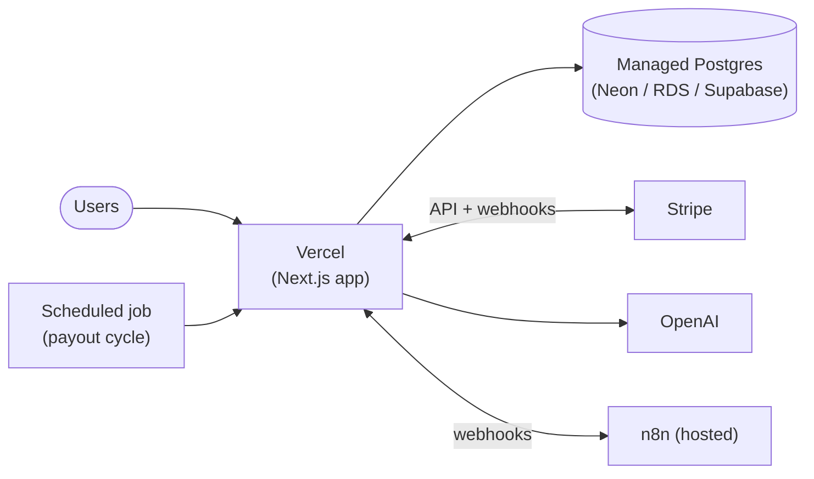

# Deployment & Local Setup

> How to run LuxeMarket locally and how to operate it in production. The stack is
> a single Next.js 14 app backed by PostgreSQL, with Stripe, OpenAI, and n8n as
> external services.

- **Package manager:** pnpm `>=9` (`packageManager: pnpm@9.12.0`)
- **Node:** `>=20` (see [`.nvmrc`](../.nvmrc))
- **Database:** PostgreSQL 16

---

## 1. Local development

### Prerequisites

- Node 20+ (`nvm use` reads [`.nvmrc`](../.nvmrc))
- pnpm 9+ (`corepack enable && corepack prepare pnpm@9.12.0 --activate`)
- Docker (for Postgres + n8n via Compose), or a local PostgreSQL

### Quick start

```bash
# 1. Install dependencies
pnpm install

# 2. Configure environment
cp .env.example .env        # then fill in secrets (see §3)

# 3. Start Postgres (and n8n) with Docker
docker compose up -d db n8n

# 4. Apply the schema and seed sample data
pnpm db:migrate             # prisma migrate dev — creates tables
pnpm db:seed                # tsx prisma/seed.ts — demo vendors/products/orders

# 5. Run the app
pnpm dev                    # http://localhost:3000
```

### Everyday scripts

All commands come straight from [`package.json`](../package.json):

| Command | What it does |
| --- | --- |
| `pnpm dev` | `next dev` — dev server with HMR |
| `pnpm build` | `prisma generate && next build` — production build |
| `pnpm start` | `next start` — serve the production build |
| `pnpm lint` | `next lint` (ESLint, `next/core-web-vitals` + Prettier) |
| `pnpm typecheck` | `tsc --noEmit` — strict type check |
| `pnpm format` | `prettier --write "src/**/*.{ts,tsx,md}"` |
| `pnpm test` | `vitest run` — unit/service tests |
| `pnpm test:watch` | `vitest` — watch mode |
| `pnpm test:e2e` | `playwright test` — end-to-end |
| `pnpm db:generate` | `prisma generate` — regenerate the client |
| `pnpm db:migrate` | `prisma migrate dev` — create/apply a migration |
| `pnpm db:push` | `prisma db push` — sync schema without a migration |
| `pnpm db:seed` | `tsx prisma/seed.ts` — seed demo data |
| `pnpm db:studio` | `prisma studio` — browse the DB |
| `pnpm db:reset` | `prisma migrate reset --force` — drop, re-migrate, re-seed |

### Running everything in Docker

The included [`docker-compose.yml`](../docker-compose.yml) brings up the full local
stack — `db` (Postgres 16 with a healthcheck + volume), `app` (built from the
[`Dockerfile`](../Dockerfile)), and `n8n`:

```bash
docker compose up --build          # db + app + n8n
docker compose up -d db n8n        # just dependencies; run `pnpm dev` on the host
docker compose down                # stop
docker compose down -v             # stop and wipe the DB volume
```

- App → http://localhost:3000
- n8n → http://localhost:5678
- Postgres → `localhost:5432` (`luxe`/`luxe`, db `luxemarket`)

The `app` service waits for `db` to pass its healthcheck (`depends_on:
condition: service_healthy`) before starting.

---

## 2. Environment variables

Copy [`.env.example`](../.env.example) to `.env`. `src/lib/env.ts` validates these
at boot with Zod and **throws in production** if a required value is missing or
malformed.

| Variable | Required | Purpose |
| --- | :---: | --- |
| `DATABASE_URL` | ✅ | Postgres connection string (Prisma) |
| `NEXTAUTH_URL` | ✅ (prod) | Canonical app URL for NextAuth callbacks |
| `NEXTAUTH_SECRET` | ✅ | Session/JWT signing secret (`openssl rand -base64 32`) |
| `STRIPE_SECRET_KEY` | ✅¹ | Stripe server key (`sk_…`) |
| `STRIPE_WEBHOOK_SECRET` | ✅¹ | Verifies `/api/webhooks/stripe` (`whsec_…`) |
| `NEXT_PUBLIC_STRIPE_PUBLISHABLE_KEY` | ✅¹ | Stripe.js publishable key (`pk_…`) |
| `STRIPE_CONNECT_CLIENT_ID` | ✅¹ | Connected-account payouts (`ca_…`) |
| `OPENAI_API_KEY` | ✅² | OpenAI key for description generation |
| `OPENAI_MODEL` | | Model id (default `gpt-4o-mini`) |
| `N8N_WEBHOOK_URL` | ✅³ | Outbound automation endpoint |
| `N8N_WEBHOOK_SECRET` | ✅³ | Shared secret for n8n webhooks |
| `NEXT_PUBLIC_APP_URL` | ✅ | Public base URL |
| `NEXT_PUBLIC_APP_NAME` | | Display name (default `LuxeMarket`) |

¹ Required for payments/checkout. ² Required for AI descriptions. ³ Required for
n8n automations. Public vars (`NEXT_PUBLIC_*`) are exposed to the browser — never
put secrets there.

> **Security:** never commit `.env`. It is git-ignored. Rotate `NEXTAUTH_SECRET`,
> Stripe, and OpenAI keys if they are ever exposed. See [`SECURITY.md`](../SECURITY.md).

---

## 3. Database & migrations

Prisma owns the schema ([`prisma/schema.prisma`](../prisma/schema.prisma)).

```bash
# Create a migration after editing the schema
pnpm db:migrate --name add_widget_table

# Apply pending migrations in CI/production (no prompts, no dev features)
pnpm exec prisma migrate deploy

# Regenerate the typed client (also part of `pnpm build`)
pnpm db:generate
```

**Rule:** in production use `prisma migrate deploy` (idempotent, applies committed
migrations). Never run `migrate dev` or `db:reset` against a production database.

---

## 4. Production

### Recommended topology



### Vercel

1. Import the repo; Vercel auto-detects Next.js.
2. **Build command:** `pnpm build` · **Install command:** `pnpm install`.
3. Set all environment variables (§2) in Project → Settings → Environment
   Variables (Production + Preview).
4. Point `DATABASE_URL` at managed Postgres (Neon, RDS, Supabase, …). Use a pooled
   connection string for serverless (e.g. Neon/PgBouncer) to avoid exhausting
   connections.
5. Run migrations on deploy: add `prisma migrate deploy` to the build/release step
   (or a deploy hook) before the app serves traffic.

### Self-hosting with Docker (standalone)

The [`Dockerfile`](../Dockerfile) is a multi-stage build that emits Next.js
**standalone** output and runs as a non-root user.

```bash
docker build -t luxemarket:1.4.0 .
docker run -p 3000:3000 --env-file .env luxemarket:1.4.0
```

> **Prerequisite:** the standalone image requires `output: "standalone"` in
> `next.config.mjs`. If it is not yet enabled, add it to the config's object:
> ```js
> const nextConfig = { output: "standalone", /* …existing… */ };
> ```
> This produces `.next/standalone`, which the Dockerfile copies into the runtime
> stage. Run `prisma migrate deploy` against the target database before the
> container serves traffic.

---

## 5. Stripe webhook configuration

The app is settled by webhooks, so Stripe must be able to reach
`/api/webhooks/stripe`.

**Local (Stripe CLI):**
```bash
stripe login
stripe listen --forward-to localhost:3000/api/webhooks/stripe
# copy the printed whsec_… into STRIPE_WEBHOOK_SECRET, then:
stripe trigger payment_intent.succeeded
```

**Production (Dashboard → Developers → Webhooks):**

1. Add endpoint `https://<your-domain>/api/webhooks/stripe`.
2. Subscribe to: `payment_intent.succeeded`, `payment_intent.payment_failed`,
   `charge.refunded`, `transfer.paid`, `transfer.failed`.
3. Copy the signing secret into `STRIPE_WEBHOOK_SECRET`.
4. For payouts, enable **Connect** and configure the platform account
   (`STRIPE_CONNECT_CLIENT_ID`); vendors onboard to get a `stripeAccountId`.

The handler verifies the signature against the raw body and de-duplicates via
`WebhookEvent` — see [`API.md`](./API.md#post-apiwebhooksstripe).

---

## 6. Running the payout cycle

Vendor earnings accrue to `Vendor.payoutBalanceCents` as orders are paid. A
periodic **payout cycle** sweeps balances into `Payout` records and issues Stripe
Connect transfers (see
[ARCHITECTURE §7](./ARCHITECTURE.md#7-multi-vendor-order-splitting-commission--payouts)).

Run it on a schedule (e.g. weekly). Options:

- **Vercel Cron** → hit a protected route/handler that runs the sweep.
- **External scheduler** (GitHub Actions `schedule`, cron on a VM) invoking a
  script such as `pnpm exec tsx scripts/run-payouts.ts`.
- **n8n** cron workflow calling the same routine.

Each cycle: pick eligible vendors (`status = APPROVED`, `payoutBalanceCents > 0`),
create a `Payout` (`PENDING`) for the period, issue the transfer, and let
`transfer.paid` / `transfer.failed` webhooks advance `Payout.status`. The operation
is safe to retry — it settles a defined `periodStart`/`periodEnd` window and is
reconciled by `stripeTransferId`.

---

## 7. Health checks & observability

- **Probe:** `GET /api/health` returns `200` when the process and DB are healthy,
  `503` otherwise. Wire it to your platform's health check and uptime monitor.
- **Logs:** webhook processing, order transitions, and payout runs emit structured
  logs; ship them to your platform's log drain.
- **Audit trail:** privileged admin actions are recorded in `AuditLog`.

---

## 8. Release checklist

- [ ] `pnpm typecheck && pnpm lint && pnpm test` green (CI enforces this)
- [ ] `pnpm build` succeeds
- [ ] `prisma migrate deploy` run against the target database
- [ ] Environment variables set for the target environment (§2)
- [ ] Stripe webhook endpoint + events configured (§5)
- [ ] `/api/health` returns `200` post-deploy
- [ ] Payout cycle scheduled (§6)
